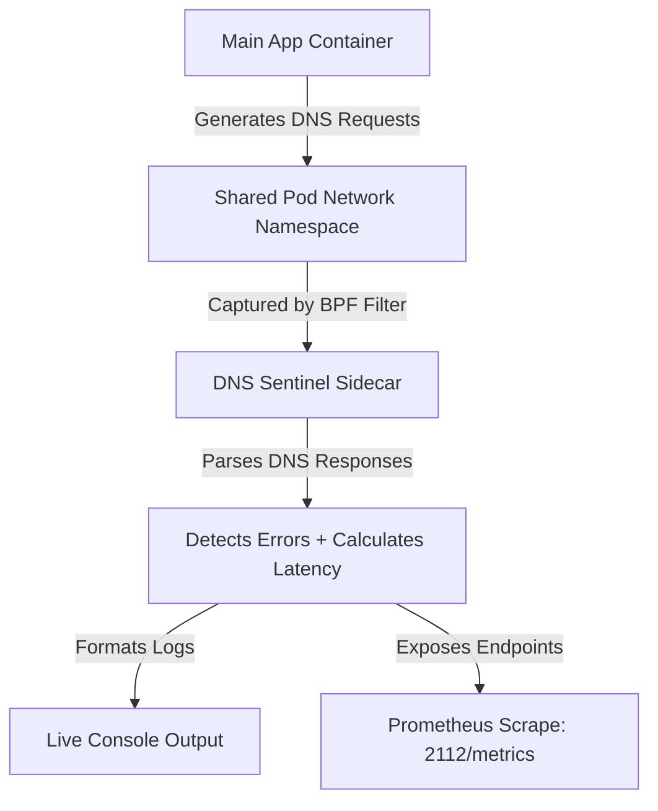

# 📡 DNS Sentinel: High-Performance, Zero-Code DNS Latency & Observability Sidecar

A highly secured, highly optimized Kubernetes sidecar built in Go for capturing, logging, and exposing real-time DNS resolution failures, packet-level transaction latency, and telemetry metrics.

---

## 💡 Problem vs. Solution

### The Problem
Microservices frequently suffer from transient network hiccups, silent DNS timeouts, or misconfigured lookups (e.g., `NXDomain` and `ServFail` errors). Investigating these typically requires:
* Modifying application source code to add verbose network request logging.
* Re-deploying applications with intensive tracing enabled.
* Correlating application-level error codes back to infrastructure anomalies.

This process is highly invasive, slow, and hard to maintain across dozens of different microservices and programming languages.

### The Solution
**DNS Sentinel** is comprised of two core components: a zero-code Sidecar for infrastructure monitoring, and a rich, interactive Dashboard for real-time observability.

**1. Zero-Code Kubernetes Sidecar**
* **No Code Intrusion**: It uses `libpcap` to transparently sniff packet traffic on the shared `eth0` interface, intercepting all DNS queries and responses (`port 53`).
* **Packet-Level Transaction Matching**: Using standard DNS 16-bit Transaction IDs (`dns.ID`), it matches queries to responses to calculate precise network-level lookup latency.
* **Smart Filtering**: Automatically filters out internal Kubernetes search path lookups (e.g., `.svc.cluster.local`) to highlight actual application dependencies.

**2. Modern Observability Dashboard**
* **Real-time Incident Streaming**: The dashboard connects via WebSockets to stream exact DNS resolution failures and latency spikes instantly.
* **Premium UX/UI**: Beautiful, responsive layout with **Light / Dark mode** seamlessly toggled via context states.
* **Centralized Auth & Analytics**: Includes a secure authentication flow and a unified control pane for monitoring overall cluster health.

---

## 🏗️ System Architecture



---

## Configs

The following variables are able to be changed by setting them in the enviortment

| Environment Key    | Default Value | Description                                         |
|-------------------|---------------|-----------------------------------------------------|
| PROMETHEUS_PORT   | 2112          | The port that the /metrics endpoint will be on      |
| DNS_PORT          | 53            | The port the sidecar will listen to for dns traffic |
| NETWORK_INTERFACE | eth0          | The network interface that will be listening on     |

## 🚀 Telemetry Features

### 1. Prometheus Telemetry Scrape
The sidecar starts a metrics server on port `2112` and exposes a standard `/metrics` endpoint.

#### Scrape Configuration
The Pod automatically advertises itself to Prometheus scrape agents using standard metadata annotations configured in `pod.yaml`:
```yaml
annotations:
  prometheus.io/scrape: "true"
  prometheus.io/port: "2112"
```

#### Exposed Metrics
* **Total Volumes**: `dns_queries_total` tracks lookup counts grouped by `domain` and `rcode` status (e.g., `NoError`, `NXDomain`).
* **Precise Latency**: `dns_query_duration_seconds` is a Prometheus Histogram capturing exact resolution latency, categorized by `domain` and `status`.

### 2. Grafana Dashboards (Judge Favorite 🌟)
Use the exposed metrics to build premium observability dashboards visualizing:
* **NXDomain/ServFail Spikes**: Detect broken microservices or misconfigured external service URLs.
* **DNS Latency Histograms**: Track network degradation and DNS resolver queue bottlenecks.
* **Top Domains**: Chart the highest-volume application lookup requests.
* **Error Rate Percentiles**: Create alerts for anomalous resolution error rates.

### 3. Anomaly & Security Detection
Leverage the collected metrics for real-time security scanning:
* **DNS Tunneling**: Flag anomalies where data is payload-exfiltrated via unusual hostname subdomains.
* **Suspicious Domains**: Alert on lookups pointing to blacklisted or unknown external domains.
* **Excessive Failed Lookups**: Stop brute-force scanning or scanning of cluster internals.

---

## 🛠️ Deploying with `demo-reset.sh`

An automated reset script is provided to handle the entire container lifecycle (rebuilding the image, loading it into the cluster, deploying the pod, and streaming sidecar logs).

### How to Run:
1. Ensure your local Kubernetes cluster (or Kind cluster) is active in Docker Desktop.
2. Run the automation script:
   ```bash
   ./demo-reset.sh
   ```

The script will automatically:
* Delete any existing `dns-monitor-pod`.
* Re-build the CGO-enabled Go binary using `golang:1.23-alpine` (caching dependencies).
* Load the built `dns-sidecar:v1` image directly into your local cluster container runtime.
* Apply [pod.yaml](pod.yaml) to schedule the multi-container pod.
* Wait for startup and begin streaming live sniffer events.

### Example Logs Output:
```text
DNS Response: google.com | Latency: 12ms | Status: OK
🚨 DNS FAILURE: broken-api.internal.local | Status: SERVFAIL | Latency: 503ms
```

### Fetching Metrics Manually
Once the Pod is running, you can forward the metrics port to inspect the raw output:
```bash
kubectl port-forward pod/dns-monitor-pod 2112:2112
```
And view them in your browser or curl:
```bash
curl http://localhost:2112/metrics
```

---

## 📅 Changelog & Recent Fixes

### Stability & Maintainability Improvements
- **Resolved Frontend Crashes**: Hardened the React application to handle asynchronous WebSocket data initialization gracefully, eliminating blank screens caused by undefined `floatingAlerts` variables.
- **Fixed Database Locking**: Resolved concurrency issues and SQLite database locking (`attempt to write a readonly database (1032)`) within the Go backend during Git rebases and task restarts.
- **Strict Linting Enforcement**: Refactored the dashboard components for robust maintainability. Removed dozens of unused `React` imports, fixed strict `useCallback` and `useEffect` dependency violations, and cleaned up legacy shim helpers for a completely warning-free production build.

### Feature Enhancements
- **Light / Dark Mode**: Integrated a fully responsive system-level Light and Dark mode using Tailwind CSS, a custom `ThemeContext`, and Lucide `Sun`/`Moon` icons.
- **Seamless Navigation**: Improved user flow across the Auth, Pitch, and Dashboard pages. Users can now easily click the "DNS Sentinel" logo to navigate back home, and the interactive flow elegantly directs unauthenticated users through a demo experience or the main login process.
